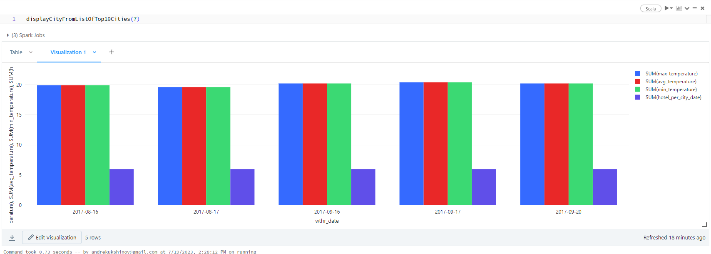

## This project is implemented in databricks with azure and to create infrastructure you should have at least 1 active azure acc with storage account created to store tf state remotely, go and edit main.tf: backend "azurerm"** with you storage acc data.
## And then you will be ready to run the app:
(First-time) Run from cmd
* make terraform-first-run

For all the subsequent runs:
* make terraform-first-run

### Then go to your created azure databricks account and run the job that was created for you


### State before incremental copy
 
### Copying

### Streaming

### State after


### Query plans:
ten_biggest_cities_ordered

resulting table(containing all the cols for visualization)


### Paris

### London 

### Barcelona

### Milan

### Amsterdam

### Paddington

### San Diego

### New York

### Vienna

### Memphis

* Add your code in `src/main/` if needed
* Test your code with `src/tests/` if needed
* Modify notebooks for your needs
* Deploy infrastructure with terraform
```
terraform init
terraform plan -out terraform.plan
terraform apply terraform.plan
....
terraform destroy
```
* Launch notebooks on Databricks cluster
